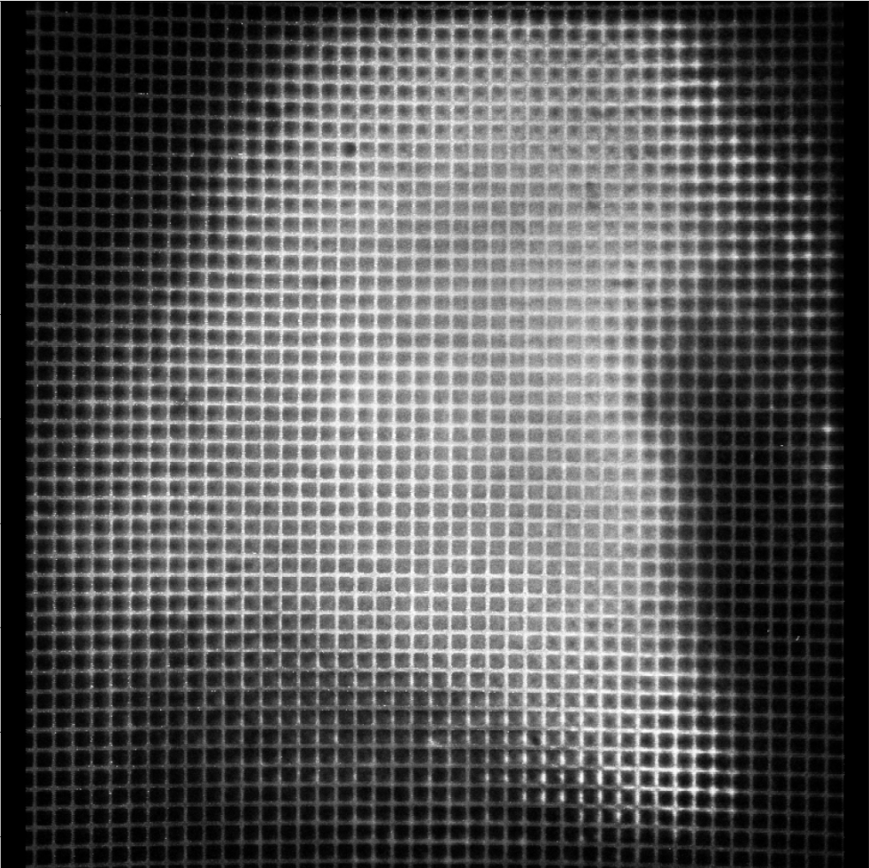
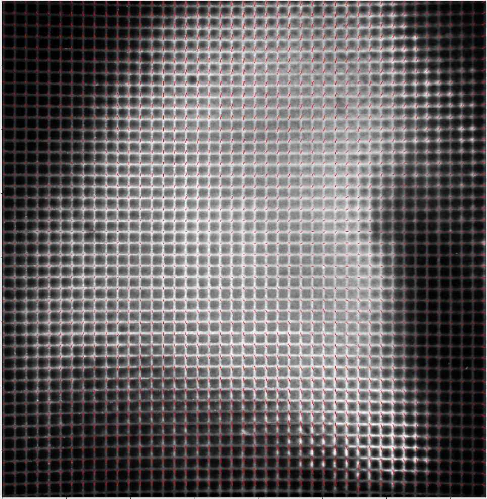
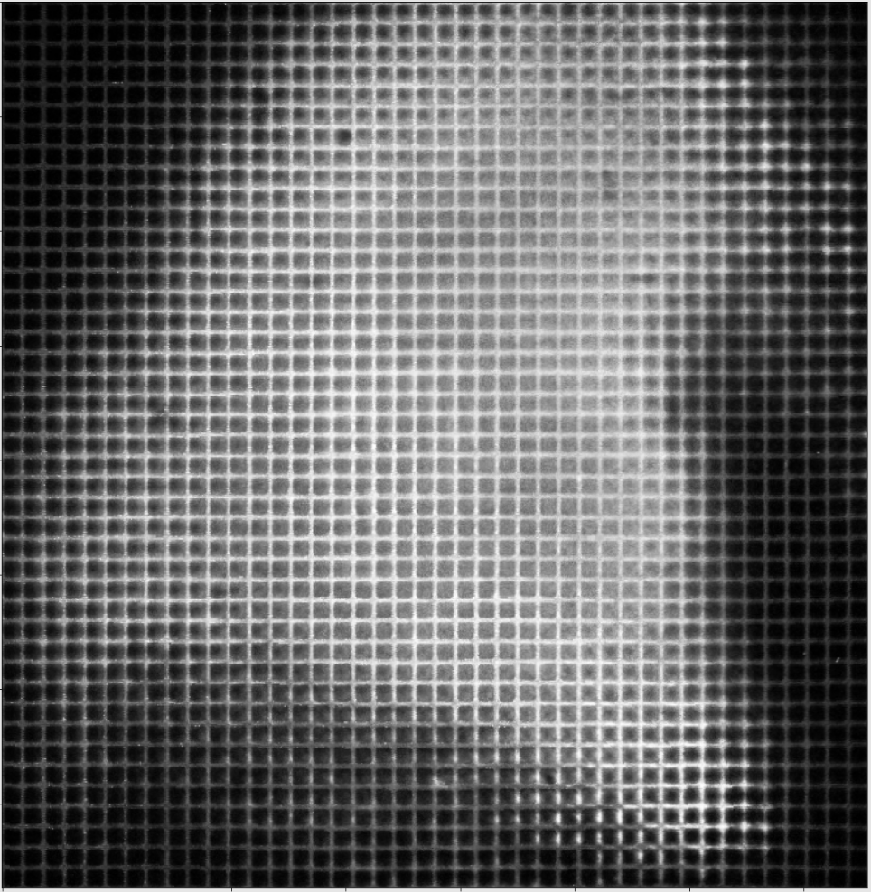

Atchuth Naveen Chilaparasetti
  * [LinkedIn](https://www.linkedin.com/in/atchutnaveench/) | [Website](naiveen.github.io)

# Deformation Correction by modeling distortion using Bezier curves

We have a highly sophisticated light sheet imaging system that produces images with nonlinear distortion. The usual radial distortion correction methods don't work. So, we modeled the distortion by imaging a uniform grid and modeling the distortion using 4th order [Bezier Surface patches](https://en.wikipedia.org/wiki/B%C3%A9zier_surface).

Steps Involved:
* Apply Homography
* Find corners
* Find corresponding points
* Model the displacement using bezier curves and create a linear system of Equations
* Solve the system of equations
* Correct using the modeled deformation

## Original Deformed Grid
  

## Corners and Correspondences

## Corrected Grid

